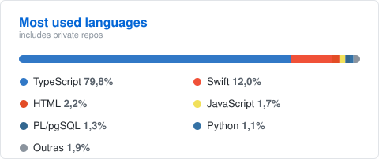

<h1>Rodrigo Luna Barcelos</h1>

<b>Computer Engineering @ Columbia University</b> &nbsp;·&nbsp; Data Engineering Intern @ Zoox Smart Data

  Computer Engineering student at Columbia University (Fu Foundation School of Engineering and Applied Science), graduating 2029. Working at the intersection of software and data — currently building data integrations in Python/FastAPI at Zoox Smart Data. Interested in software engineering, data infrastructure, and systems.

  
   
  

<h4>Contato</h4>

  
  

<h3 align="center">Com o que eu trabalho</h3>

  
  
  
  
  
  

   

  
  
  
  
  
  

    

  
  
  
  
  
  
  
  

